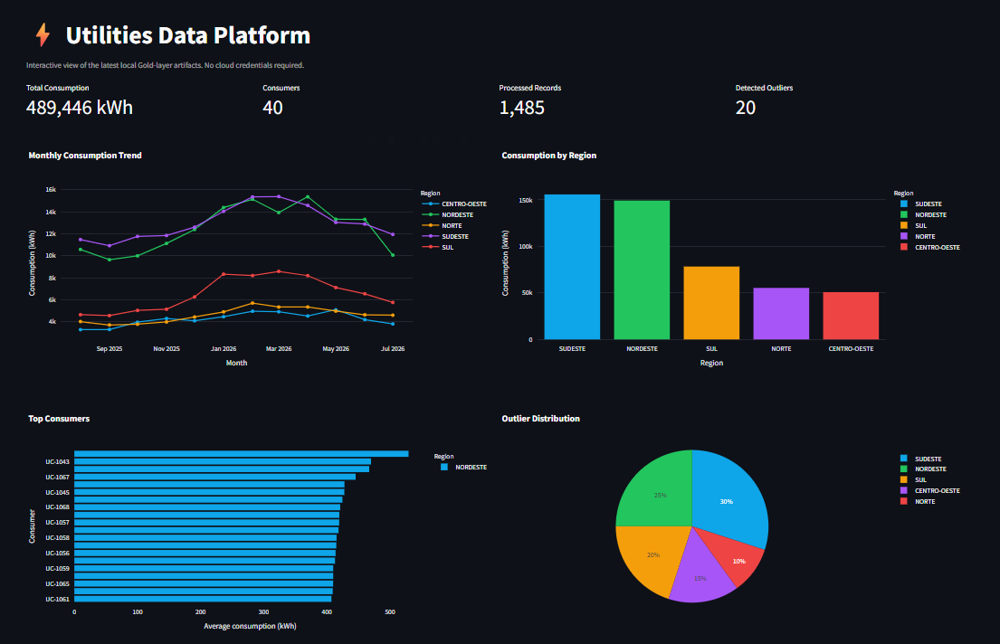
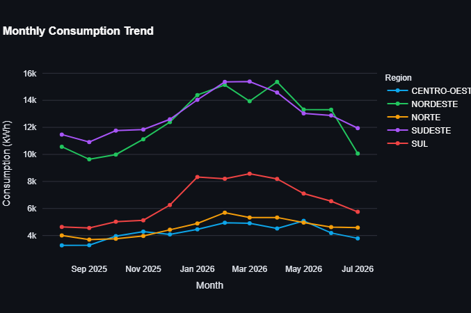
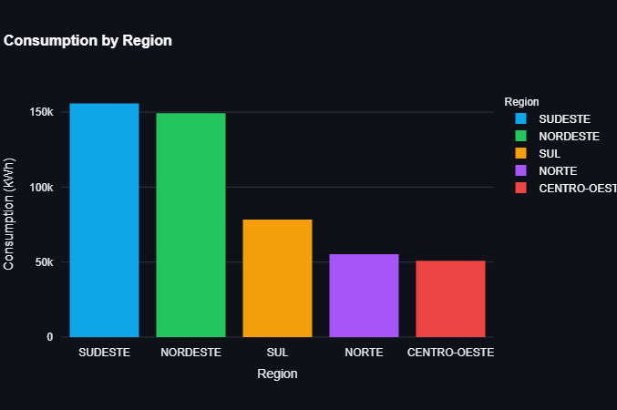

<h1 align="center">⚡ Utilities Medallion Pipeline</h1>

<p align="center">A local-first Data Engineering portfolio project for utility-energy consumption analytics.</p>

<p align="center">
  
  
  
  
  <a href="https://github.com/arthurczo/utilities-etl-pipeline/actions/workflows/ci.yml"></a>
  
</p>

## Project overview

This project processes synthetic utility meter readings through a Medallion pipeline and exposes business-ready consumption metrics. It demonstrates data quality controls, deterministic file-based CDC, Airflow orchestration and an interactive local dashboard—without requiring cloud credentials.

## Architecture

<p align="center"><br><em>Local-first Medallion processing with optional BigQuery and Looker Studio serving layers.</em></p>

## Technology stack

Python · Pandas · PyArrow · Apache Airflow · Docker Compose · Streamlit · Plotly · Pytest · Optional Google BigQuery

## Medallion architecture

| Layer | Responsibility | Output |
|---|---|---|
| Bronze | Preserves source data and ingestion metadata. | `bronze_*.parquet` |
| Silver | Validates, types, standardizes, deduplicates and flags IQR outliers. | `silver_*.parquet` |
| Gold | Produces regional monthly metrics and a top-consumer ranking. | `gold_*.parquet` |

CDC uses stable SHA-256 row hashes with a local checkpoint. Writes are atomic so incomplete Parquet artifacts are never published.

## Pipeline flow

<p align="center"><br><em>Airflow schedules daily processing; CDC observes inserts and updates without blocking ingestion.</em></p>

## Dashboard

The Streamlit dashboard reads the latest Gold artifacts from `data/gold/`. It includes KPI cards and filters for region, month and consumer, plus interactive Plotly views for consumption trends, regional totals, top consumers and outlier distribution.

<p align="center"><br><em>Dashboard overview generated from the local Gold layer.</em></p>

<p align="center"> <br><em>Interactive dashboard views: monthly trend and regional consumption.</em></p>

## Airflow orchestration

`utilities_medallion_pipeline` runs daily at 06:00 (America/Sao_Paulo), with two retries, a 20-minute task timeout, no catchup and one active run at a time. The DAG executes CDC → Bronze → Silver → Gold → charts.

## Project structure

```text
assets/       Diagrams, dashboard screenshots and demo guidance
dashboard/    Streamlit app, page and reusable components
dags/         Airflow DAG
data/         Local source, Medallion artifacts and runtime state (ignored)
src/          Bronze, Silver, Gold, CDC, visualization and shared utilities
tests/        Focused business-rule and dashboard-data tests
```

See [PROJECT_STRUCTURE.md](PROJECT_STRUCTURE.md) for ownership details.

## Running locally

```bash
python -m venv .venv
# Windows: .venv\Scripts\activate | Linux/macOS: source .venv/bin/activate
pip install -r requirements.txt
python scripts/generate_sample_data.py
python -m src.bronze.ingest
python -m src.silver.transform
python -m src.gold.aggregate
python -m src.visualization.generate_charts
streamlit run dashboard/app.py
```

`make generate`, `make run` and `make test` provide the same shortcuts on systems with GNU Make.

## Running with Docker

```bash
docker compose up airflow-init  # first run only
docker compose up
```

Open `http://localhost:8081` and sign in with `admin` / `admin`. The Docker stack runs Airflow and Postgres; the dashboard remains a local Streamlit process.

## Testing

```bash
python -m pytest -q
python -m compileall -q src dags scripts dashboard
```

GitHub Actions runs these checks on every push.

## Results

<p align="center"> <br><em>Static reports produced directly from Gold artifacts.</em></p>

## Future improvements

See [ROADMAP.md](ROADMAP.md). The next highest-value improvements are infrastructure-as-code for BigQuery/IAM and log-based CDC for a production data source.

## License

Distributed under the [MIT License](LICENSE).
