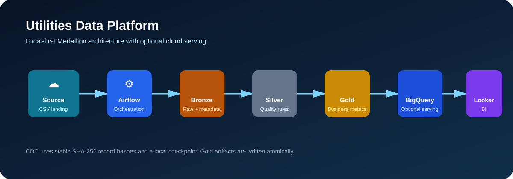
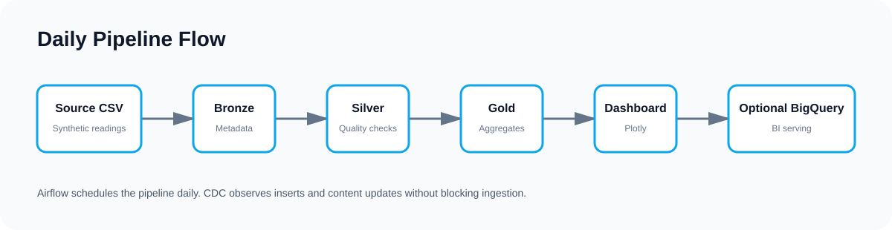
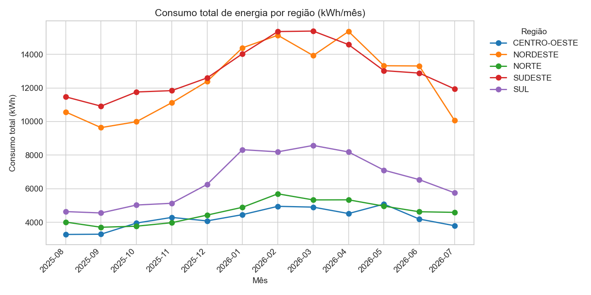
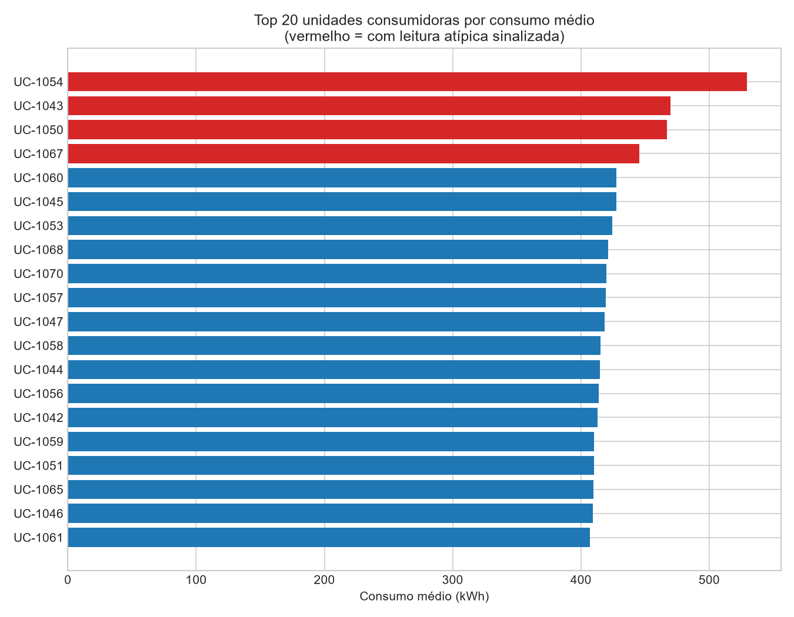

<h1 align="center">⚡ Utilities Medallion Pipeline</h1>
<p align="center">A local-first Data Engineering portfolio project for utility-energy consumption analytics.</p>
<p align="center">
  
  
  
  
  
  
</p>

## Features

- Medallion pipeline with atomic Parquet artifacts: Bronze → Silver → Gold.
- Data quality controls, regional IQR outlier flags and deterministic CDC simulation.
- Production-minded daily Airflow DAG with retries, timeout and no backfill.
- Optional BigQuery serving layer; all core functionality runs locally.
- Streamlit + Plotly dashboard reading the latest Gold artifacts.

## Architecture

<p align="center"></p>

## Pipeline flow

<p align="center"></p>

## Dashboard

The local dashboard provides KPI cards, filters for region/month/consumer, and interactive views for trends, regional consumption, top consumers and outlier distribution. It never requires GCP.

```bash
streamlit run dashboard/app.py
```

It reads `data/gold/` generated by the ETL. If artifacts are absent, run the pipeline first.

## Screenshots

<p align="center">
  
  
</p>

## Folder structure

```text
assets/       Architecture diagrams and real-demo recording guidance
dashboard/    Streamlit dashboard and Pipeline Overview page
dags/         Airflow orchestration
src/          Medallion layers, CDC and visualization
tests/        Focused business-rule tests
data/         Local artifacts and state (ignored by Git)
```

More detail: [PROJECT_STRUCTURE.md](PROJECT_STRUCTURE.md).

## Running

```bash
python -m venv .venv
# Windows: .venv\Scripts\activate | Linux/macOS: source .venv/bin/activate
pip install -r requirements.txt
make generate
make run
streamlit run dashboard/app.py
```

For Airflow, run `docker compose up airflow-init` once, then `docker compose up`. Open `http://localhost:8081` with `admin` / `admin`.

## Testing

```bash
python -m pytest -q
python -m compileall -q src dags scripts dashboard
```

The GitHub Actions workflow runs the same checks on every push.

## Future improvements

See [ROADMAP.md](ROADMAP.md). The highest-value next steps are infrastructure-as-code for BigQuery/IAM and log-based CDC for a production source. For authentic demo recordings, see [assets/README.md](assets/README.md).
